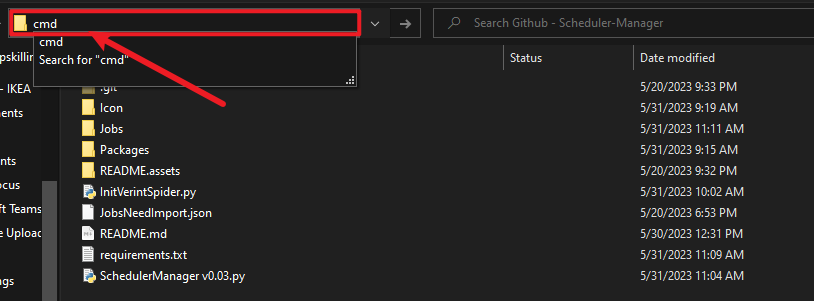
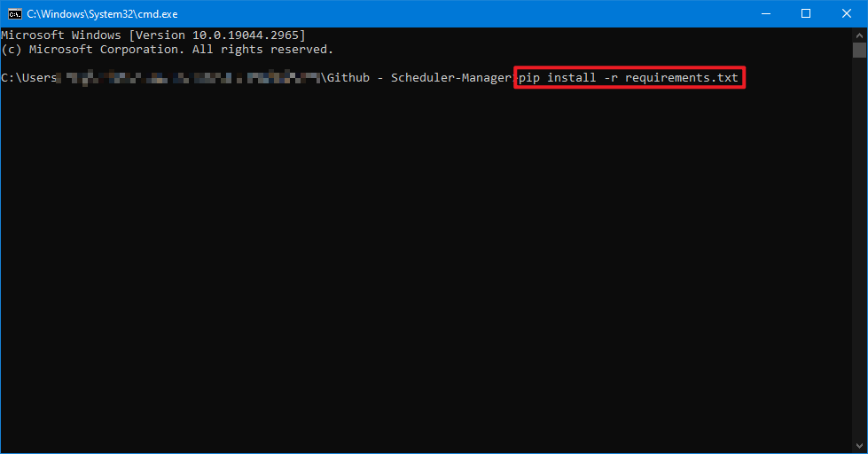

# 
Scheduler Manager

## 1. Prerequisites:

1. Open current folder, type `cmd` to open cmd with current working directory

   

2. run below command from file explorer:
   `pip install -r requirements.txt`

   

## 2. How to use it

Run the `SchedulerManager.py`

> If you want import jobs from Verint, go to `Run Spider` Tab -> `run Verint Spider` first, after it finished, go to `Import` Tab -> `Import json`

## 3. How to config my Net Spider

open & edit `InitVerintSpider.py` and change account and password.

1. If you need import jobs from existing json, please name it as "JobsNeedImport.json" and put it in same folder as Scheduler Manager.py

    

---
## Update History:

v0.01 Init Version

v0.02 Fixed a bug of wrong time when add a new job manually, added icon, remap json file to `Jobs`` folder

v0.03 Added Verint Spider, fixed a bug that import wrong parameters when bulk add.

v0.04 Added Verint Config page, not fully implemented.
